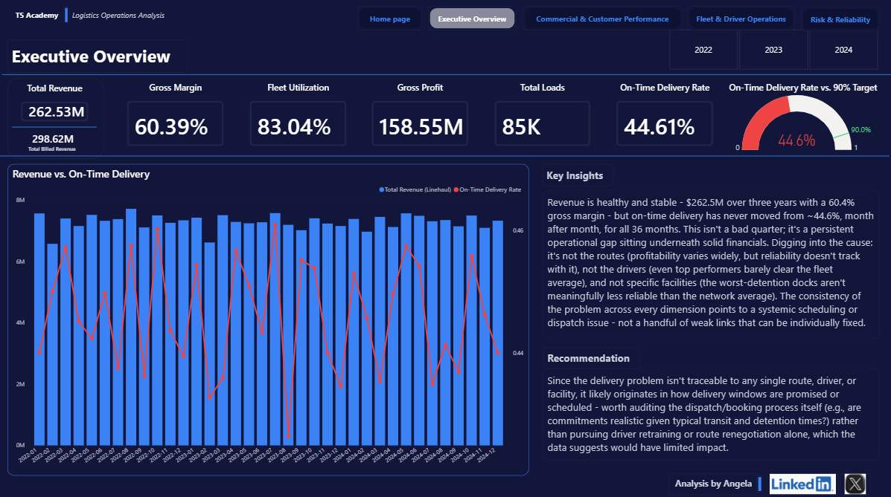

# Logistics Operations Capstone

A four-dashboard Power BI report analysing a 14-table relational database for a trucking and freight company, covering operations from 2022 to 2024.

## The question
How is the business performing on revenue, customers and fleet health, and what is holding service quality back?

## The key finding
The on-time delivery rate stayed flat at about **44.6% across all 36 months**. This number is the thread that runs through all four dashboards, so the report tells one connected story instead of four separate sets of charts.

## What I did
- **Modelled a 14-table relational dataset** in Power BI Desktop.
- **Defined revenue two ways and documented the difference** instead of silently choosing one:
  - *Total Revenue* (linehaul only): `SUM(loads[revenue])` = $262.53M
  - *Total Billed Revenue* (revenue + fuel surcharge + accessorial charges) = $298.6M
  - The billed figure appears only on the Executive Overview, as a secondary stat next to the main revenue card.
- **Built four dashboards:**
  - Executive Overview: headline KPIs
  - Commercial: customer performance, with a customer type slicer
  - Fleet Operations: trucks and drivers, with an employment status slicer
  - NAME OF FOURTH DASHBOARD: SHORT DESCRIPTION
- **Synced a Year slicer across all pages** and excluded 2025 with a report-level filter, because only part of that year's data exists.
- **Applied a custom dark navy theme** (JSON), inspired by a reference dashboard design.

## Other insight
About **65% of the fleet is 2015 model-year trucks**, which points to an ageing-fleet risk alongside the flat delivery performance.

## Files
- `FILE-NAME.pbix`: the Power BI report
- `FILE-NAME.pdf`: PDF export of all pages
- `THEME-FILE-NAME.json`: custom theme
- `executive-overview.png`: screenshot used above

## Tools
Power BI Desktop, DAX, Power Query, relational data modelling

Built by Angela Iseriehen
